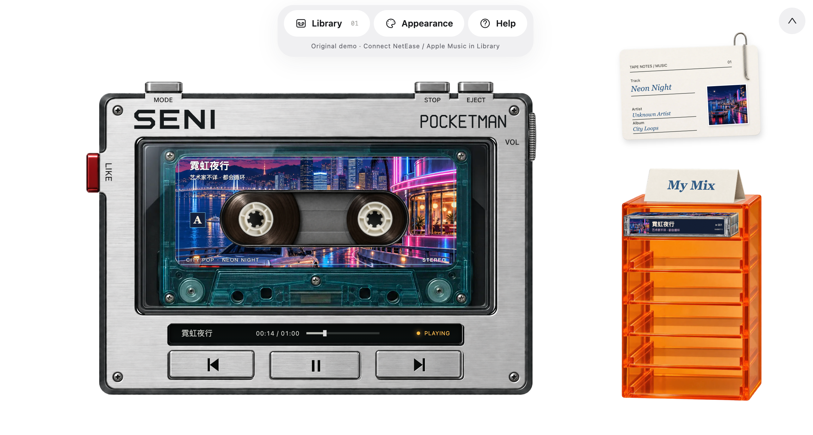
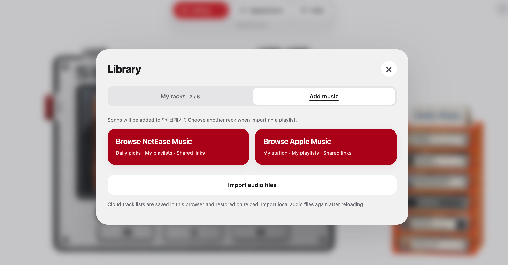

# 复古磁带播放器 · Retro Cassette Player

> **Noncommercial use only · 请勿商用**

SENI / POCKETMAN is a retro music player with a cassette player skin inspired by portable stereos: a silver deck, spinning white spindles, mechanical buttons and an orange rack for your collection. Built with HTML, CSS, JavaScript and a small local Node.js server. The full local version can connect to Apple Music and NetEase Cloud Music.

**关键词 / Keywords:** 音乐播放器 · 播放器皮肤 · 随身听 · 磁带 · 复古 · 苹果音乐（Apple Music）· 网易云音乐（NetEase Cloud Music）

English · [简体中文](README.zh-CN.md)

[Open the web player](https://syrene8655-cloud.github.io/seni-pocketman/) — play the demo or import local audio. Music service connections are available when running the full version locally.

## Screenshots

Screenshots of the full local version. Music service connections require the local server.





## Press play

- Play the included original one-minute demo **霓虹夜行** without signing in.
- Import your own audio files, with embedded metadata and artwork.
- Organize tracks in cassette racks, flip tapes to side B, and change shell colors.
- Play, pause, stop, seek and adjust volume, with mechanical button sounds.
- Optionally connect your own NetEase Music or Apple Music account.

**English is the default.** Open **Appearance → Language** to switch between English and 中文. Your choice is remembered in this browser. Switching does not reload the page or interrupt playback. Track, artist and custom rack names keep their original text.

## Run locally

Install **Node.js 22 or newer**, download and extract this repository, then run these commands in the project folder:

```sh
npm ci --ignore-scripts --no-audit --no-fund
npm start
```

Open **http://127.0.0.1:8768/**. On macOS, you can also double-click `启动.command` after installing Node.js.

Use `127.0.0.1`, not `localhost`, for the current origin checks. If the port is busy, run `PORT=8770 npm start` and use that port. Press `Ctrl+C` in the terminal to stop the server.

The full player requires its Node.js service. `npm run build:pages` creates a static web edition in `.pages-site/`; the Pages workflow publishes it automatically. This edition supports the demo and local audio imports, with music service connections available in the locally running full version.

## Bring your music

**Local files:** import audio in Library. Files are read by your browser. Local file references do not survive a page reload, so you may need to import them again. A saved rack list is not a backup of the audio files.

**NetEase Music:** sign in with a QR code in Library. The server keeps the session in memory; restarting it requires signing in again. Subscription, purchase, preview and region restrictions follow the music service's response.

**Apple Music:** provide your own MusicKit developer credentials and connect an account with playback access. See [optional configuration](docs/configuration.md). No developer private keys or account credentials are included. Live account authorization and DRM playback must be verified with your own configuration.

## Loading and privacy

The loading bar uses a 10-second estimate. The player opens as soon as required assets are ready; after 10 seconds it continues waiting if necessary, with a retry message for prolonged failures.

This edition contains no original production-site telemetry. Optional music features contact their respective providers. The demo audio, visual assets and button sounds are served locally.

## Development

Edit the source and reload the page. Run the tests with:

```sh
npm test
```

| File | Purpose |
| --- | --- |
| `index.html`, `style.css` | Page and layout |
| `i18n.js` | English / Chinese UI and saved language choice |
| `player.js`, `hardware-controls.js` | Playback and physical controls |
| `racks.js`, `geometry.js` | Cassette racks and asset positioning |
| `server.cjs` | Local files and music APIs |
| `assets/`, `vendor/` | Runtime artwork, sounds and vendor notices |
| `tests/` | Backend and language regression tests |

## License

This is a source-available project. See the [license](LICENSE.md) for the terms.

Required Notice: Copyright 2026 syrene8655-cloud

Third-party code and Kenney CC0 sounds retain their own licenses. Artwork includes AI-generated and manually prepared assets. See [Third-party notices](THIRD_PARTY_NOTICES.md). The project is not affiliated with the music platforms or hardware manufacturers.
